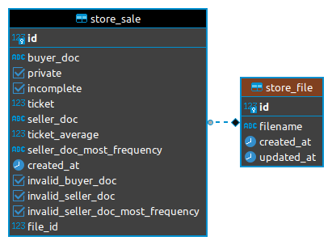

# challenge-neoway

Neoway challenge solution

- [Execute project](#execute-project)
- [Database](#database)
- [Endpoints](#endpoints)
  - [Files](#files)
    - [Upload File](#upload-file)
    - [List Files](#list-files)
    - [Get File](#get-file)
  - [Sales](#sales)
    - [List Sales](#list-sales)
    - [Get Sale](#get-sale)

## Execute project

_Obs: To execute the project [docker](https://docs.docker.com/engine/install/) and [docker-compose](https://docs.docker.com/compose/install/) are needed_

After `git clone` or downlod project, execute this command in terminal to install dependences, make migrations database and run the project.

```bash
docker-compose up
```

## Database

_Obs: database migrations were generate by Django command `python manage.py makemigration`_

<p align=center>
    <b><i>ER Diagram</i></b>
    <br />
</p>

## Endpoints

_Obs: there is a [insomnia](https://insomnia.rest/download) collection [file](documentation/endpoints-collection.json) with the endpoints test._

### Files

#### Upload File

**Request**

`PUT /stores/files/upload/`

    curl -i -X PUT -H 'Content-Type: text/plain' --data-binary '@base_example.txt' http://localhost:8000/stores/files/upload/

**Response**

    HTTP/1.1 201 Created
    Date: Sun, 22 Aug 2021 14:41:53 GMT
    Server: WSGIServer/0.2 CPython/3.9.6
    Content-Type: application/json
    Vary: Accept, Cookie
    Allow: PUT, OPTIONS
    X-Frame-Options: DENY
    Content-Length: 152
    X-Content-Type-Options: nosniff
    Referrer-Policy: same-origin

    {
        "id": 10,
        "filename": "/media/45d0f9f84cc44fa796a344cce60ea6f7.txt",
        "created_at": "2021-08-22T14:41:53.220798Z",
        "updated_at": "2021-08-22T14:41:53.220879Z"
    }

#### List Files

**Request**

`GET /stores/files/`

    curl -i -X GET -H 'Content-Type: application/json' http://localhost:8000/stores/files/

**Response**

    HTTP/1.1 200 OK
    Date: Sun, 22 Aug 2021 14:46:36 GMT
    Server: WSGIServer/0.2 CPython/3.9.6
    Content-Type: application/json
    Vary: Accept, Cookie
    Allow: GET, HEAD, OPTIONS
    X-Frame-Options: DENY
    Content-Length: 1783
    X-Content-Type-Options: nosniff
    Referrer-Policy: same-origin

    {"count":1,"next":null,"previous":null,"results":[{"id":1,"filename":"http://localhost:8000/media/574a510dd5f04dcab6f2fa8220c1ad51.txt","created_at":"2021-08-21T20:16:31.680726Z","updated_at":"2021-08-21T20:16:31.680860Z"}]}

#### Get File

**Request**

`GET /stores/files/`

    curl -i -X GET -H 'Content-Type: application/json' http://localhost:8000/stores/files/1/

**Response**

    HTTP/1.1 200 OK
    Date: Sun, 22 Aug 2021 14:53:47 GMT
    Server: WSGIServer/0.2 CPython/3.9.6
    Content-Type: application/json
    Vary: Accept, Cookie
    Allow: GET, HEAD, OPTIONS
    X-Frame-Options: DENY
    Content-Length: 172
    X-Content-Type-Options: nosniff
    Referrer-Policy: same-origin

    {"id":1,"filename":"http://localhost:8000/media/574a510dd5f04dcab6f2fa8220c1ad51.txt","created_at":"2021-08-21T20:16:31.680726Z","updated_at":"2021-08-21T20:16:31.680860Z"}

### Sales

#### List Sales

**Request**

`GET /stores/sales/`

    curl -i -X GET -H 'Content-Type: application/json' http://localhost:8000/stores/sales/

**Response**

    HTTP/1.1 200 OK
    Date: Sun, 22 Aug 2021 14:57:40 GMT
    Server: WSGIServer/0.2 CPython/3.9.6
    Content-Type: application/json
    Vary: Accept, Cookie
    Allow: GET, HEAD, OPTIONS
    X-Frame-Options: DENY
    Content-Length: 2965
    X-Content-Type-Options: nosniff
    Referrer-Policy: same-origin

    {"count":40,"next":"http://localhost:8000/stores/sales/?page=2","previous":null,"results":[{"id":1,"buyer_doc":"04209828840","private":false,"incomplete":false,"ticket":"161.22","seller_doc":"79379491000850","ticket_average":"161.22","seller_doc_most_frequency":"79379491000850","created_at":"2013-06-12T00:00:00Z","invalid_buyer_doc":false,"invalid_seller_doc":false,"invalid_seller_doc_most_frequency":false,"file":1},{"id":2,"buyer_doc":"05818942198","private":false,"incomplete":false,"ticket":null,"seller_doc":null,"ticket_average":null,"seller_doc_most_frequency":null,"created_at":null,"invalid_buyer_doc":false,"invalid_seller_doc":true,"invalid_seller_doc_most_frequency":true,"file":1},{"id":3,"buyer_doc":"06614830961","private":false,"incomplete":false,"ticket":"229.00","seller_doc":"79379491000850","ticket_average":"229.00","seller_doc_most_frequency":"79379491000850","created_at":"2013-04-18T00:00:00Z","invalid_buyer_doc":false,"invalid_seller_doc":false,"invalid_seller_doc_most_frequency":false,"file":1},{"id":4,"buyer_doc":"10152085769","private":false,"incomplete":false,"ticket":null,"seller_doc":null,"ticket_average":null,"seller_doc_most_frequency":null,"created_at":null,"invalid_buyer_doc":false,"invalid_seller_doc":true,"invalid_seller_doc_most_frequency":true,"file":1},{"id":5,"buyer_doc":"07784408854","private":false,"incomplete":false,"ticket":null,"seller_doc":null,"ticket_average":null,"seller_doc_most_frequency":null,"created_at":null,"invalid_buyer_doc":false,"invalid_seller_doc":true,"invalid_seller_doc_most_frequency":true,"file":1},{"id":6,"buyer_doc":"05810010954","private":false,"incomplete":false,"ticket":null,"seller_doc":null,"ticket_average":null,"seller_doc_most_frequency":null,"created_at":null,"invalid_buyer_doc":false,"invalid_seller_doc":true,"invalid_seller_doc_most_frequency":true,"file":1},{"id":7,"buyer_doc":"25591761810","private":false,"incomplete":true,"ticket":null,"seller_doc":null,"ticket_average":null,"seller_doc_most_frequency":null,"created_at":null,"invalid_buyer_doc":false,"invalid_seller_doc":true,"invalid_seller_doc_most_frequency":true,"file":1},{"id":8,"buyer_doc":"05098485916","private":true,"incomplete":false,"ticket":null,"seller_doc":null,"ticket_average":null,"seller_doc_most_frequency":null,"created_at":null,"invalid_buyer_doc":false,"invalid_seller_doc":true,"invalid_seller_doc_most_frequency":true,"file":1},{"id":9,"buyer_doc":"02352131952","private":false,"incomplete":false,"ticket":null,"seller_doc":null,"ticket_average":null,"seller_doc_most_frequency":null,"created_at":null,"invalid_buyer_doc":false,"invalid_seller_doc":true,"invalid_seller_doc_most_frequency":true,"file":1},{"id":10,"buyer_doc":"89109830278","private":false,"incomplete":false,"ticket":null,"seller_doc":null,"ticket_average":null,"seller_doc_most_frequency":null,"created_at":null,"invalid_buyer_doc":false,"invalid_seller_doc":true,"invalid_seller_doc_most_frequency":true,"file":1}]}

#### Get Sale

**Request**

`GET /stores/sales/`

    curl -i -X GET -H 'Content-Type: application/json' http://localhost:8000/stores/sales/1/

**Response**

    HTTP/1.1 200 OK
    Date: Sun, 22 Aug 2021 14:53:47 GMT
    Server: WSGIServer/0.2 CPython/3.9.6
    Content-Type: application/json
    Vary: Accept, Cookie
    Allow: GET, HEAD, OPTIONS
    X-Frame-Options: DENY
    Content-Length: 172
    X-Content-Type-Options: nosniff
    Referrer-Policy: same-origin

    {
        "id": 1,
        "filename": "http://localhost:8000/media/574a510dd5f04dcab6f2fa8220c1ad51.txt",
        "created_at": "2021-08-21T20:16:31.680726Z",
        "updated_at": "2021-08-21T20:16:31.680860Z"
    }
